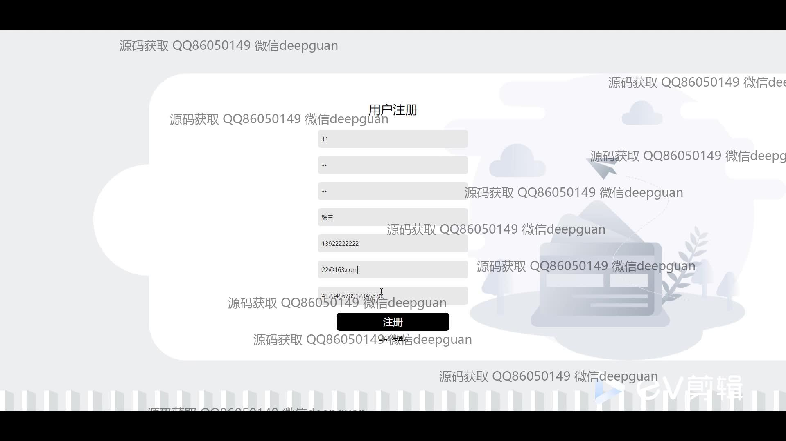
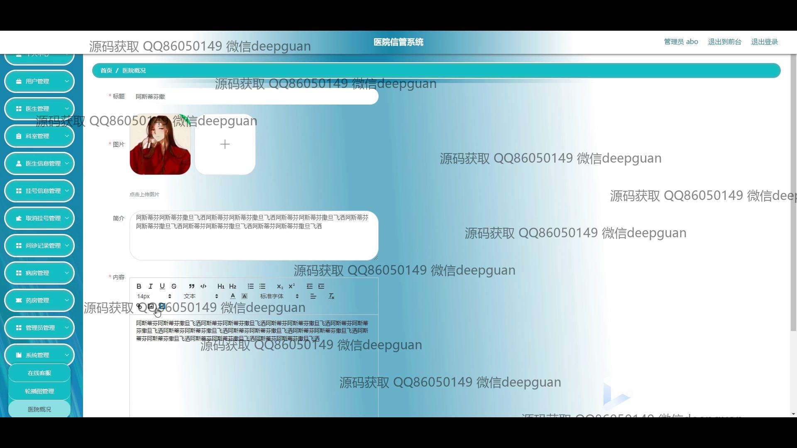
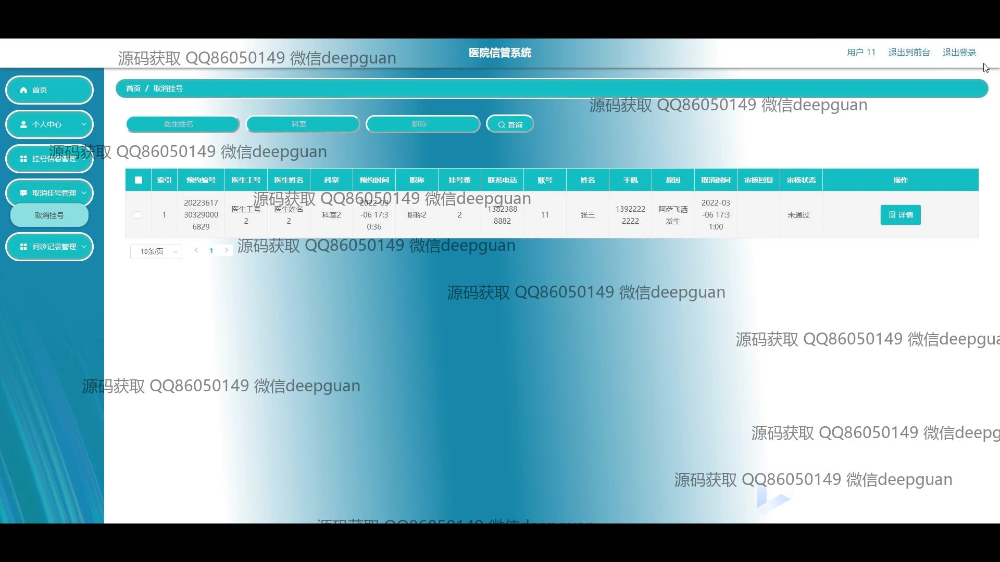

<h1 align="center">医院信管系统</h1>

## 简介
医院信管系统：角色分为管理员、医生；功能包括用户管理、医生信息管理、挂号信息管理、药房管理、病房管理、个人中心访问和预约挂号管理，界面设计简洁，提升医院运营效率。    --计算机毕业设计源码；毕设源码；java毕业设计源码

## 联系方式

<h3 align="center">获取完整代码与数据库文件 + 微信：deepguan QQ: 86050149 QQ群: 783742310</h3>

<h3 align="center">可帮忙远程部署 包运行成功！提供远程部署、修改代码、设计文档指导、代码讲解等服务！</h3>

## 功能介绍（完整见运行截图）
管理员：基本功能包括登录、用户管理、医生信息管理、科室管理、病房管理等，增强系统的权限控制和用户管理效率。管理员能够对整个系统进行模块化的管理操作，如医生管理页面可输入相关信息便捷地维护医生资料，药房管理界面允许管理员更新药品信息及库存数据，病房管理则帮助管理员有效地对医院的病房资源进行配置和调整。此外，管理员还可以管理挂号信息、导航至后台进行更为细致的管理操作，提升医院整体运作效率。

医生：医生角色可通过登录界面验证身份并进入系统，访问到专属的个人中心，这里医生可以查看和更新个人信息，包括姓名、科室、职称、挂号费等基本资料。系统支持医生查询患者挂号信息、预约时间、联系方式等，查看与管理病人的咨询记录和处方开具。医生也能够通过界面进行问诊记录管理，探索和了解患者的症状与病史，并为其提供后续的治疗建议，帮助优化诊疗流程和患者关系。

患者：患者在系统中通过注册可以创建账号，填写基本信息包括用户名、密码、手机、邮箱等个人资料。登录后可访问个人中心进行信息的修改与查看。患者可以通过简单的操作搜索医生信息，按照需求预约挂号，填写相关的就诊信息，有效管理自己的预约记录。这一系统还提供在线客服选项，方便患者解决疑问，并为预约、挂号、咨询等提供一系列便捷功能以优化用户体验。

药房管理人员：药房管理人员登录后可以访问药房管理功能模块，负责输入和更新药品的具体信息，如药品编码、英文名称、类别、剂型、厂商信息等。同时还有药品库存调整、生产日期和价格的维护任务。界面支持上传药品图片及修改药房的整合数据，保障药品的安全性与完整性。整体设计架构旨在确保药房日常运营的平稳顺利，帮助管理人员高效管理药品库，确保医院药品使用合理化。

## 运行截图

本代码来源于网络,仅供学习参考使用!

